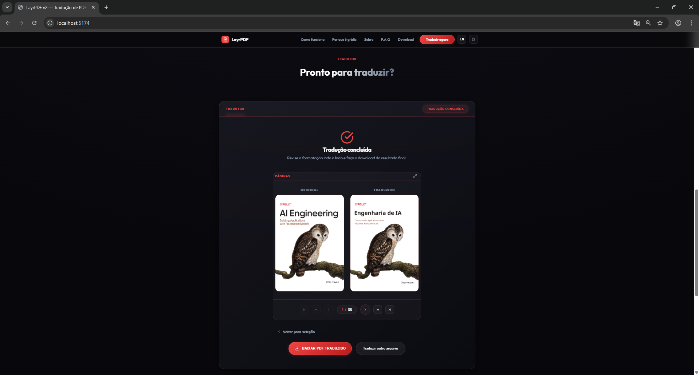
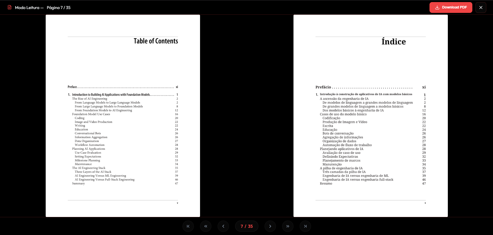
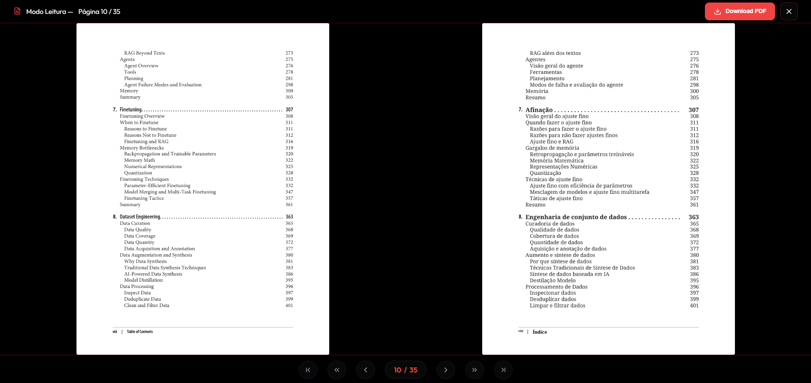
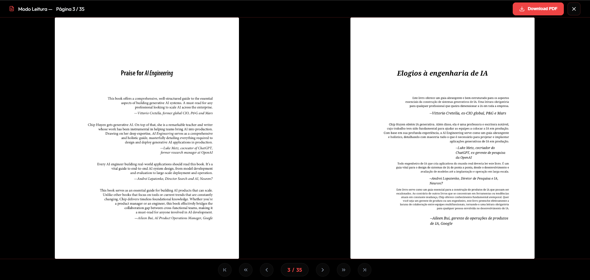
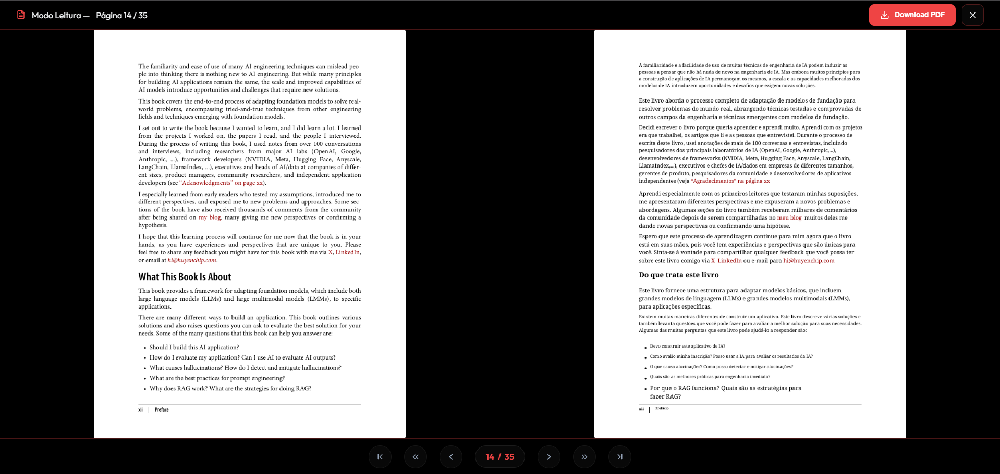
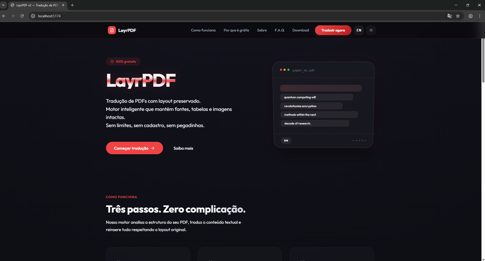
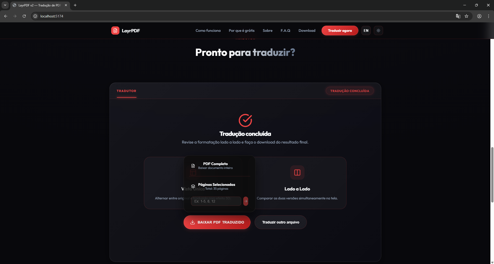
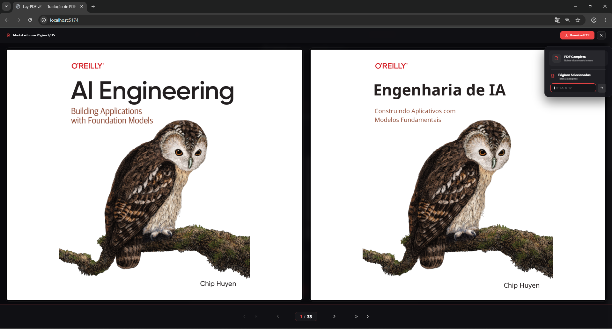

# Screenshots de Referência

Capturas de tela para demonstração e regressão visual do LayrPDF. Clique nas imagens para ampliar.

## Before/After | Comparações Técnicas

**Capa e Preservação de Identidade Visual**

**Alinhamento de Sumário (Dots e Paginação) - Caso 1**

**Alinhamento de Sumário (Dots e Paginação) - Caso 2**

**Estilos Tipográficos (Itálicos e Citações)**

**Listas (Bullets) e Hierarquia de Parágrafos**

## Interface SPA

**Estados da Tela Inicial (Hero Section)**

**Pipeline de Tradução (Idle → Completed)**

**Modo de Leitura com PDF Renderizado**
